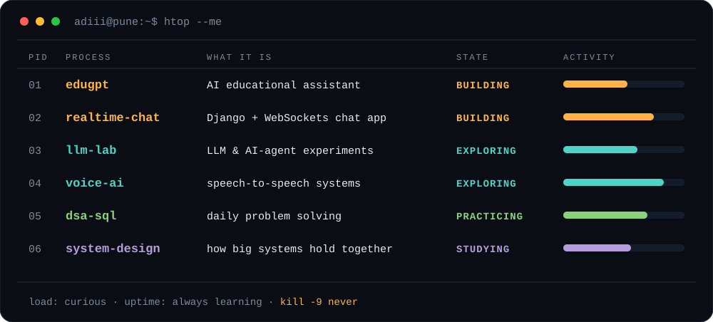
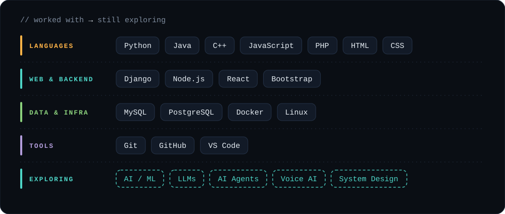
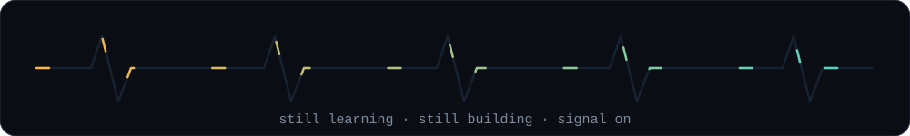

<div align="center">

</div>

<br>

```console
$ whoami
aditya manjare — mca @ pccoe, pune

$ cat about.txt
i build practical software, experiment with ai,
and like turning ideas into things that actually run.
student, not senior. still learning, still shipping small things.

$ cat now.txt
llms · ai agents · voice ai · real-time apps · system design · dsa
```

<br>

### `01` &nbsp;·&nbsp; running right now

<div align="center">

</div>

<br>

### `02` &nbsp;·&nbsp; the stack

<div align="center">

</div>

<br>

### `03` &nbsp;·&nbsp; heads down

<div align="center">
<br>
<br>

</div>

<br>

### `04` &nbsp;·&nbsp; activity

<div align="center">

</div>

<br>

### `05` &nbsp;·&nbsp; open channel

Open to feedback, collaboration and conversations about AI, backend, and anything real-time.

**email** &nbsp;[adityamanjare84@gmail.com](mailto:adityamanjare84@gmail.com) &nbsp;·&nbsp; **github** &nbsp;[@adiii-0717](https://github.com/adiii-0717) &nbsp;·&nbsp; **linkedin** &nbsp;[Aditya Manjare](https://www.linkedin.com/)

<br>

<div align="center">

</div>
